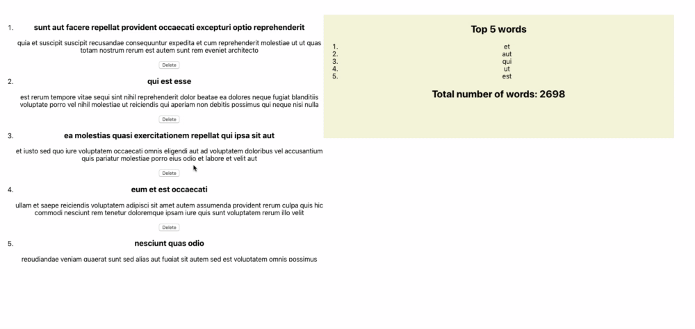
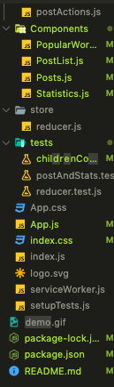

This project was bootstrapped with [Create React App](https://github.com/facebook/create-react-app).

## AtomInvest Code Challenge

### The Task
The task was to create a React & Redux application that renders all items from the endpoint https://jsonplaceholder.typicode.com/posts
In addition to this, the app should display a statistics section at the top with the following statistics:

1) Total Word Count – the total word count across all the posts
2) Top Five Frequent Words – the top five most used words across all the posts

Finally, the user should be able to delete any post from the list which should in turn dynamically update the statistics. Note: The delete feature does not call any API and only will only delete the post from the Redux store.

### Assumptions
The data presented was in the form of an array of objects, each object had a body and title attribute which both had strings. I assumed that the statistic section needed to include words from both the body and title of each individual object.

### Credits
1) React.js & Redux
2) Enzyme
3) Jest
4) Redux Mock Store
5) Prop-Types

### Getting started
Before you get started, please ensure you have the latest version of npm installed
1) clone this repository
3) type the command "npm install" to install the dependancies
3) type the command "npm start" to start the local server which should run the application

### Tests
I used create-react-app to build this application, so it was already shipped with Jest, to view all the tests passing, type the command "npm start"

### File Structure

